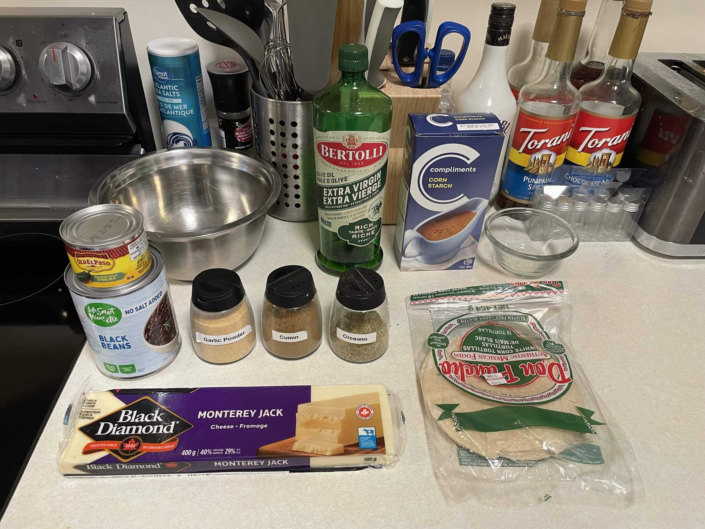
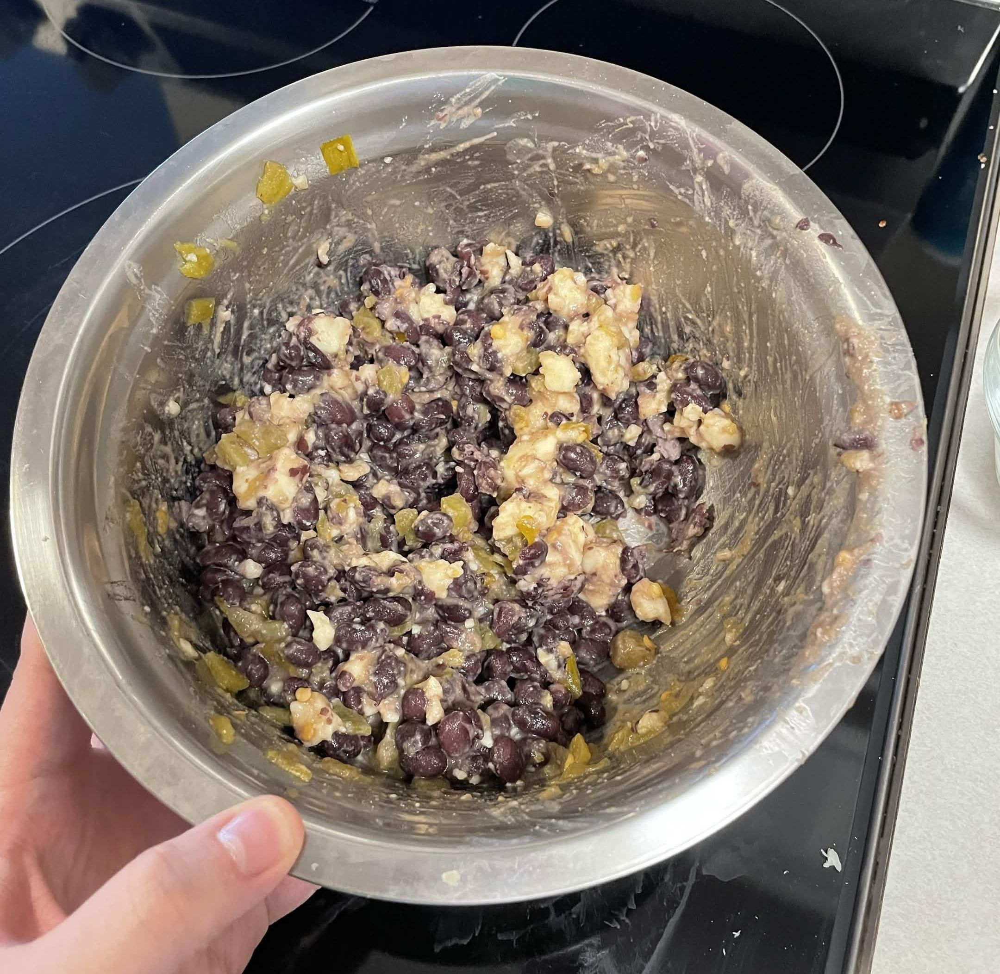
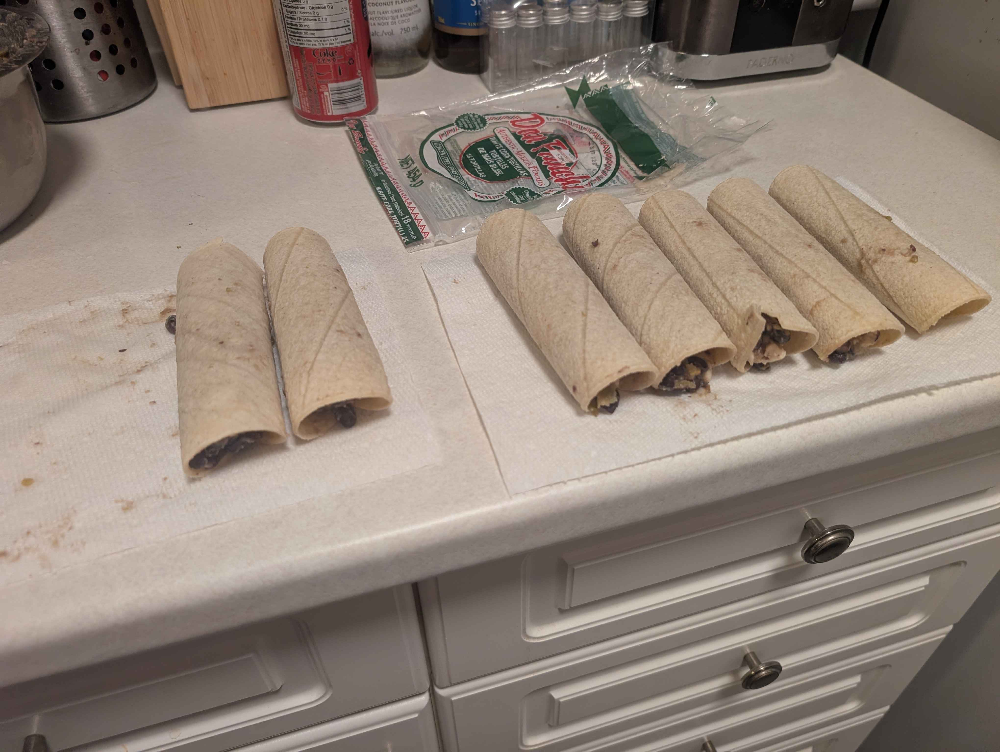
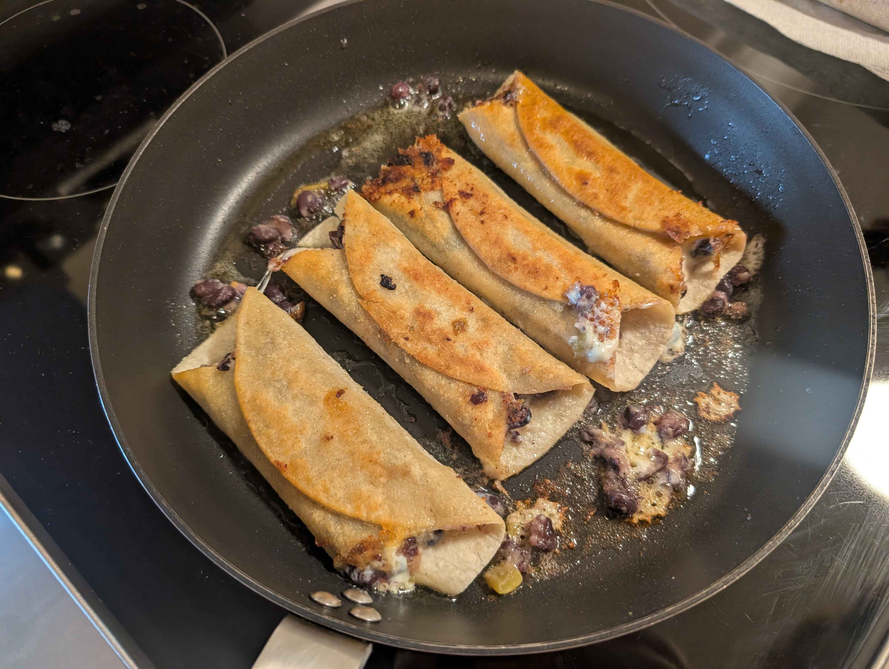

Keeping up with my [2026 Bingo Card](/blog/2025_bingo), I'm making one new recipe each month.
My partner and I have been having a hard time figuring out what to have for dinner recently.
To solve this, we watch old Adam Ragusea videos on YouTube for ideas.
At the time, I didn't have a reason, but I ended up deciding on his <a href="https://www.youtube.com/watch?v=3oFk6d7XNJ8" target="_blank" rel="noopener noreferrer">Taquitos</a> recipe.

After thinking about it for a few days, I was more emboldened in my choice.
Something that's bothered me since I immigrated to Canada is that, Mexican food almost doesn't exist here.
There are a few Mexican spots, but they're both few and far between, and almost always the “millennial restaurant” type setting.
What better way to get some Mexican food than have some white person attempt to make it at home for the first time?

## Ingredients

- 1 can of black beans
- 1 can of chopped green chilies
- 1/3 block Monterey jack cheese
- Cumin, dried oregano, garlic powder, and salt
- Pack of corn tortillas
- Cornstarch

You'll also need whatever it is you want to top them with.
The video suggest pico de gallo, but you can craft whatever you want that's in theme.

## Tools Needed
- Large skillet or griddle
- Large mixing bowl
- Small mixing bowl

## Preparation
1. Drain and rinse beans.
2. Break apart cheese into bite-sized pieces.
3. Add cornstarch and water to small mixing bowl. Microwave for 20 seconds.

The cornstarch and water will make a binding we'll use later to seal the taquitos while rolling.

## Cooking

1. Add black beans, green chilies, cheese, spices, and salt to a large mixing bowl.
2. Grab, squish, and mix the mixture with your hands until combined.
3. Taste test, and add more seasoning to taste.
4. Add mixture to corn tortilla and cornstarch binding to the top outer layer.
5. Roll the tortilla shell closed, resting on the binding and seam. Repeat until mixture is gone.
6. Fry in a thin layer of oil seam side down until brown. Flip and repeat.

    
    

It can be tricky to fry them without them blowing up.
I chose to use tongs, although you can use your fingers if you're feeling risky.
The main goal is to cook them on the seam and really make sure that seam gets sealed shut by the cornstarch glue and the cooking of the oil.
They can burn fast in a way you can't see, so check on them often.

## Final Results

**My partner's thoughts:**
It's pretty bland.
I like the corn tortilla.
There wasn't as much filling as it looked to be.
It's a pretty palatable dish, I don't have many criticisms generally.

**My thoughts:**
If you're going to make this, make pico de gallo.
He says to in the video, I just accidentally forgot to buy the ingredients to make it.
It's bland without some kind of extra thing to dip or cover it in.