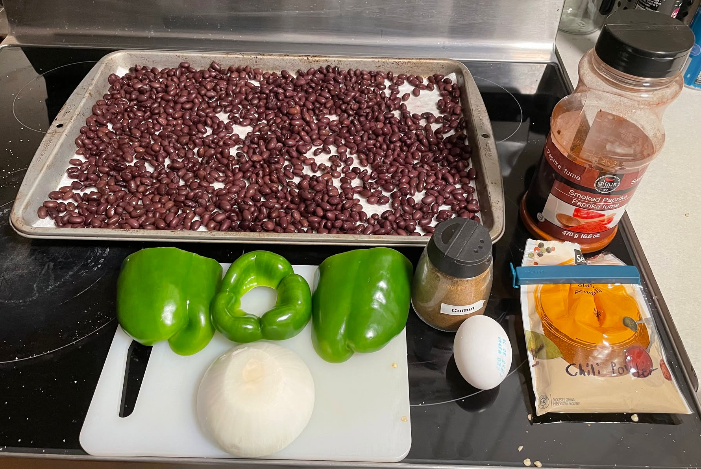
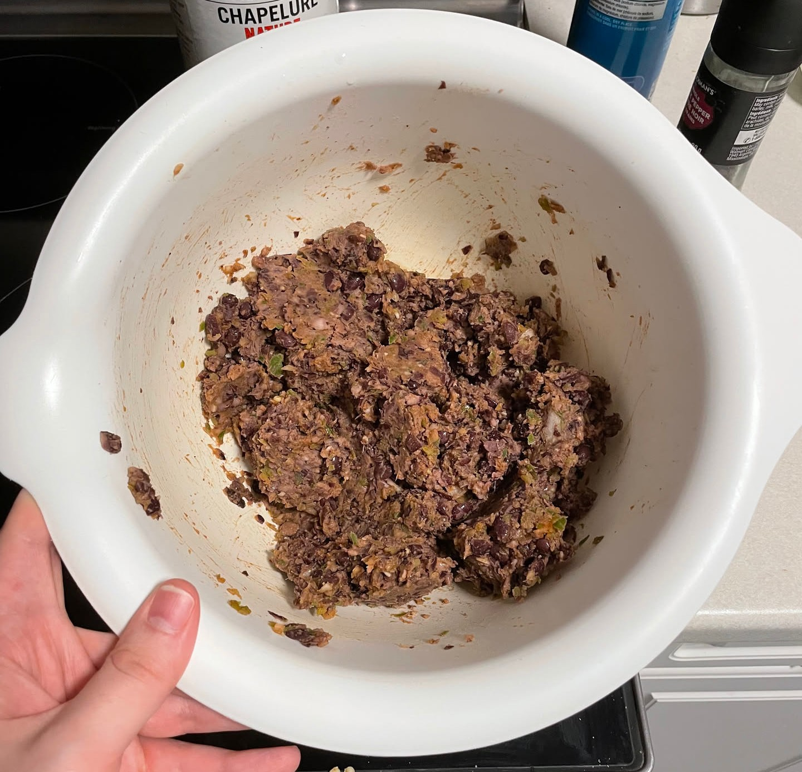
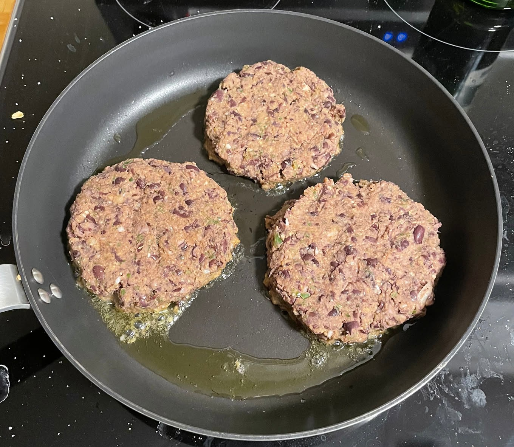
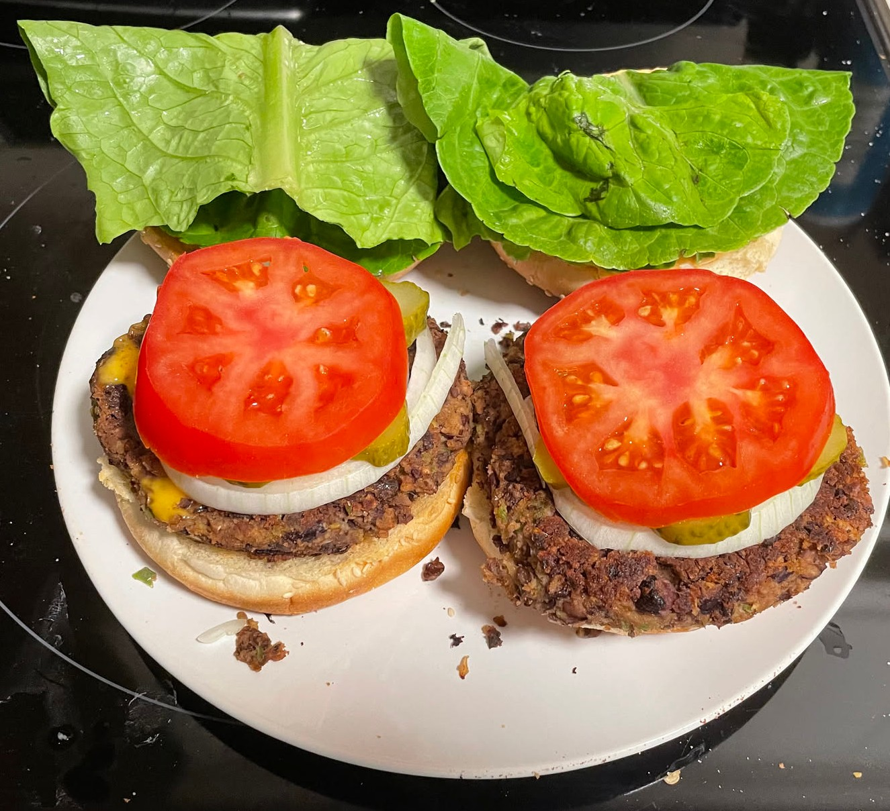

Keeping up with my [2026 Bingo Card](/blog/2025_bingo), I'm making one new recipe each month.
Black bean burgers are something that I've been interested in making for many years.
My partner has also had an invested interest in them as well, we've just been putting it off for some time.

The number one trendy vegan recipe you always see on social media is black bean burgers.
It's impossible to avoid while looking at recipes, for good reason.
They're a staple for vegans to enjoy a nice burger without eating meat at all.
You can also meal-prep a ton of them and eat them whenever for any meal.

Getting started, I'll be following a recipe from <a href="https://www.liveeatlearn.com/black-bean-burgers/" target="_blank" rel="noopener noreferrer">liveeatlearn</a>.
I followed this recipe exactly, minus chilling the mixture for 24 hours.
I was impatient and didn't realize I had to do this, so I made due without.
The risk was that they may be mushy or not as structurally sound.

## Ingredients

- 2 cans of black beans (1000 ml)
- 1 green bell pepper
- 1/2 medium white onion
- 2 garlic cloves
- 1 tsp of smoked paprika, cumin, and chili powder
- Salt and pepper to taste
- 1 large egg
- 1 cup of panko breadcrumbs

## Tools Needed
- Food processor
- Mesh sieve
- Wooden spatula
- Metal bowl
- Large skillet (or any frying pan)

If you bought no or low sodium beans, add more salt.
You can also make this vegan by replacing the large egg with flax seed and water, but I don't know how to do that, so I can't help you.

## Preperation

1. Drain and dry black beans.
2. Mix spiced into small bowl.

## Cooking

1. Add onion, bell pepper, spices, garlic, salt, and pepper to food processor. Pulse until chopped.
2. Move processed mixture to sieve and use spatula to press water out.
3. Combine mixture and black beans in food processor and pulse until combined. Leave big chunks of beans.
4. Transfer mixture to bowl. Add egg and breadcrumbs. Mix.

From here, you can either jump into making the patties or add to the fridge for 30 minutes to 24 hours.

    
    

Each patty should be half a cup.
You can make them whatever size you want - I didn't personally measure it out.
Some ended up way bigger than others.
Cooking is fun when I don't have to measure things out precisely. :D
Add as many as you can to your frying pan and go nuts.
I didn't time how long they were on each side, but it's standard procedure.
Cook until golden brown on both sides, or however you like them.
Can't really get sick from beans, but be aware of the eggs.

## Final Results

**My partner's thoughts:**
It did end up turning out mushy, but I think I liked that?
Maybe cook for longer at lower heat if we end up doing that recipe again.
As usual with burgers, the toppings (mostly the onion) ended up overpowering the burger itself.
Still didn't like the lettuce very much, maybe I'm just an iceberg lettuce girl.
Burger sauce paired with it insanely well, making me wish I put more on.
Same with olives.
The seasonings smelled and tasted incredible, but I think I just really like black beans.
I would probably eat the burgers on their own, honestly.
I think I did that with some black bean burgers I got from Costco.

**My thoughts:**
I had a lot of fun making these.
During the creation process, they smelled incredible.
Cooking them was straightforward compared to meat and meat-substitute products.
However, eating the burgers was completely standard.
They were better than fake meat burgers, but were a little more bland compared to them.
I want to be clear that they did taste good, and I enjoyed them, but they were a standard burger eating experience.
I had lettuce, onion, tomato, burger sauce, and pickles.
Next time, I'm going to only add tomato, cheese, and more burger sauce.

Overall, they were great burgers.
Despite the amount of setup and time required to make them, I'd love to make them again.
I'm not a massive fan of having to use the food processor because it's always a pain to clean, so I might find a way to make this without that.
I can see myself playing around with the recipe a bit more, maybe check out someone else's take on the dish for more ideas.
It's very versatile, filling, and easily storable to have for multiple days.