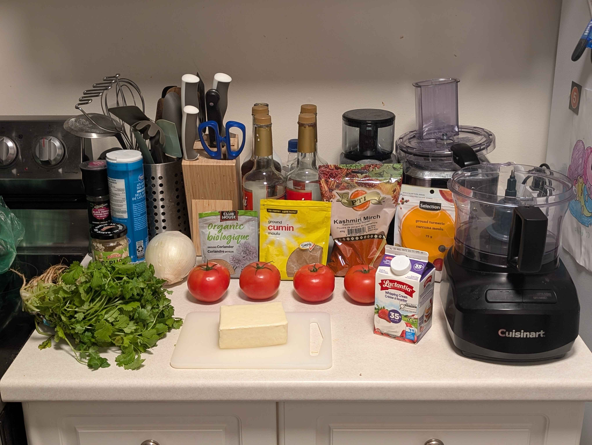
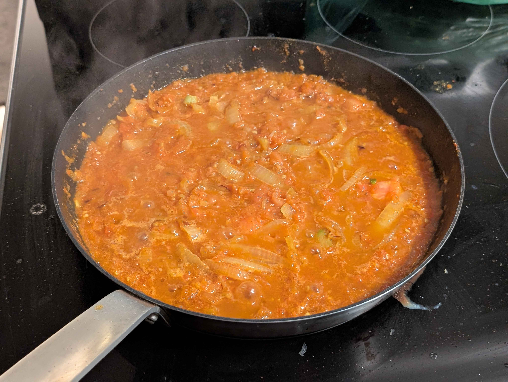
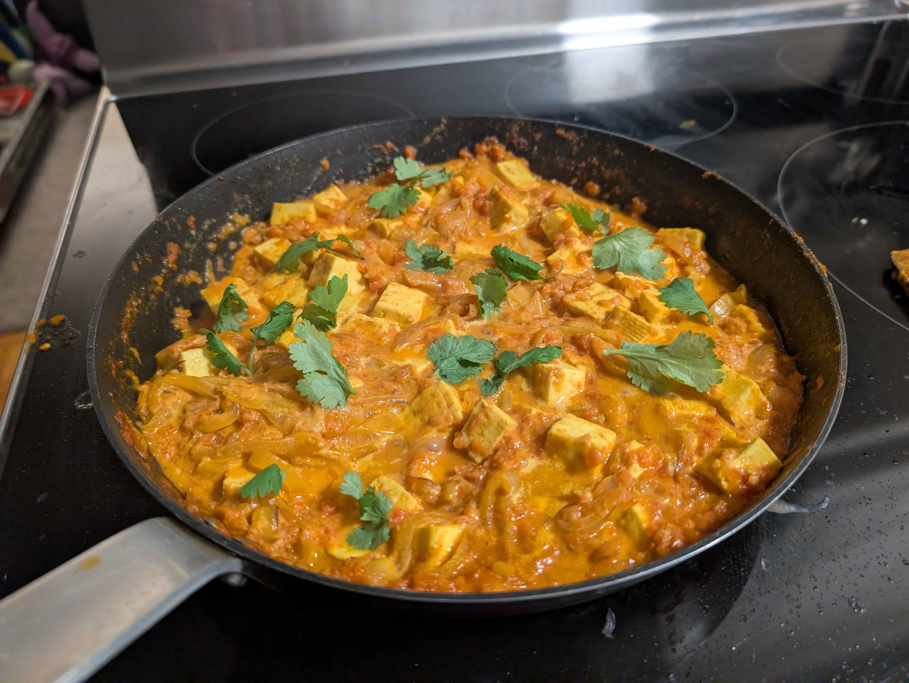
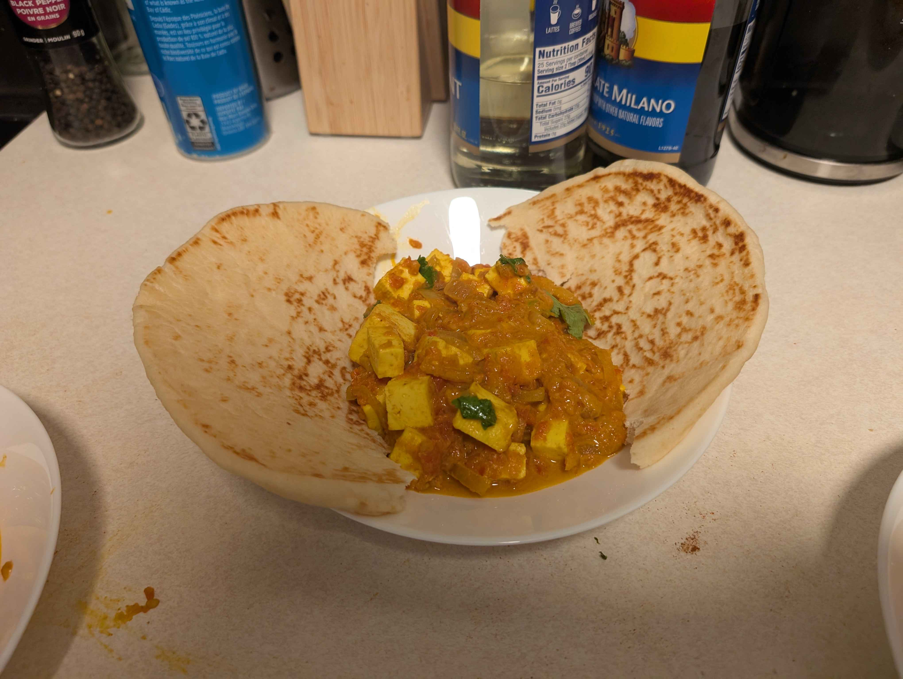

Keeping up with my [2026 Bingo Card](/blog/2025_bingo), I'm making one new recipe each month.
I wanted to make something with paneer this month since I've been craving it.
I've been eating a lot more Indian food since I moved to Canada, and I have a lot of experience with premade Indian sauces, but never from scratch.
This time, I decided I wanted to try my hand at making the sauce from scratch.

After talking with some friends, my friend Waffle helped me land on <a href="https://www.allrecipes.com/recipe/212521/shahi-paneer/" target="_blank" rel="noopener noreferrer">this recipe</a>.
It seemed fairly simple, only having a few ingredience that I had to manage.
The only trick part was finding the special Indian seasoning, **Kashmiri red chili powder**.
Luckily, where I live, there's a massive Indian population.
The grocery stores tend to cater to their cooking styles, and I was able to find it in a large, cheap amount.
Never would have been able to find that back in the states.

## Ingredients

- Any amount of naan you want
- 1 block of paneer
- 1 large white onion*
- 4 large tomatoes
- 4 cloves of garlic
- 1 tsp ground coriander and ground cumin
- 1/2 tsp Kashmiri mirch and ground turmeric
- 1 tsp white sugar
- 1/4 cup heavy cream

As a note, most Indian dishes use **red onions or shallots**.
Consider using this instead of a white onion for better results.

## Tools Needed

- Large skillet (or any frying pan)
- Wooden spatula
- Food processor

## Preperation

1. Puré your tomatoes in the food processor.
2. Thinly slice your white onion. Cut it in half and slice them into half-moons.
3. Combine your coriander, cumin, turmeric, and Kashmiri mirch into a small bowl.

## Cooking

1. Heat some oil in your pan on medium heat.
2. Add your onion and garlic. Cook until golden brown. Remove as much water as possible.
3. Mix in your prepared seasoning mixture. Cook for about 30 seconds.

4. Combine your tomato puré with onions. Cook until reduced.
5. Add paneer, sugar, and salt to taste. Stir paneer in gently.
6. Continue to reduce while allowing paneer to absorb flavour.
7. Stir in heavy cream. Reduce heat to a simmer, allowing the mixture to reduce a bit more.

When I finished, it was looking a little wet.
I was worried that I had done something wrong.
I'm not the best at reducing wet food, it's a big weakness of mine while cooking.
This is my second time trying to make an Indian dish from scratch, so my hopes weren't very high to begin with.
I wasn't going to be disappointed if it turned out poorly.

You can add some cilantro here for garnish if you have some lying around.
I also added a little bit of extra sugar to combat the acidity.
Serve with naan, and you've got yourself a dinner!

## Final Results

**My partner's thoughts:**
The tomato was too acidic.
It kind of ruined the dish for me.
It wasn't very complex tasting to begin with, but the recipe is simple, so I didn't expect much better.
The naan improved it greatly, but I still didn't really like it.
4/10

**My thoughts:**
I miscalculated at every step of the process.
I cut the onions too big, and didn't let them golden brown enough.
The onions were still wet when I added the tomatoes.
I didn't let the tomatoes reduce enough.
By the time I started eating, I was getting large bites of what tasted like tomato soup.
Because the tomatoes didn't reduce enough, the paneer didn't absorb enough flavour and it turned out bland.
My biggest weakness, reducing liquid, turned out to have ruined this dish due to my inexperience.
The only saving grace was the naan, which was so flavourful, it saved the dish from being inedible.

This was a big learning experience for me.
I gained some more insight into trusting my gut on letting things reduce.
Premade Indian sauce jars end up being thick after reducing them a bit, which is how this should have turned out.
I also learned that I should be combining my seasoning in a bowl before I start cooking so I can quickly add them all at once.
While the dish was a failure, it was still edible, and I learned more than I have cooking in over a decade. 
