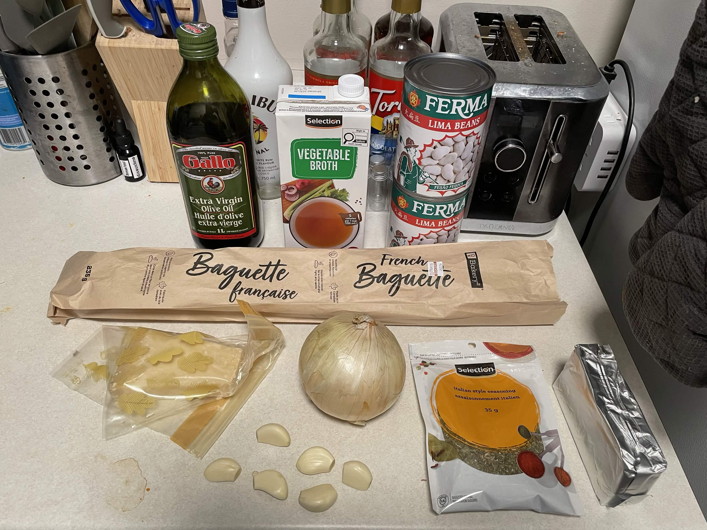
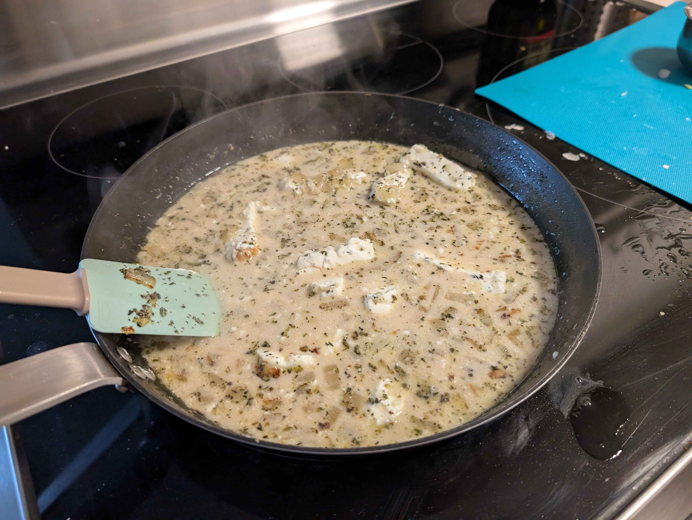
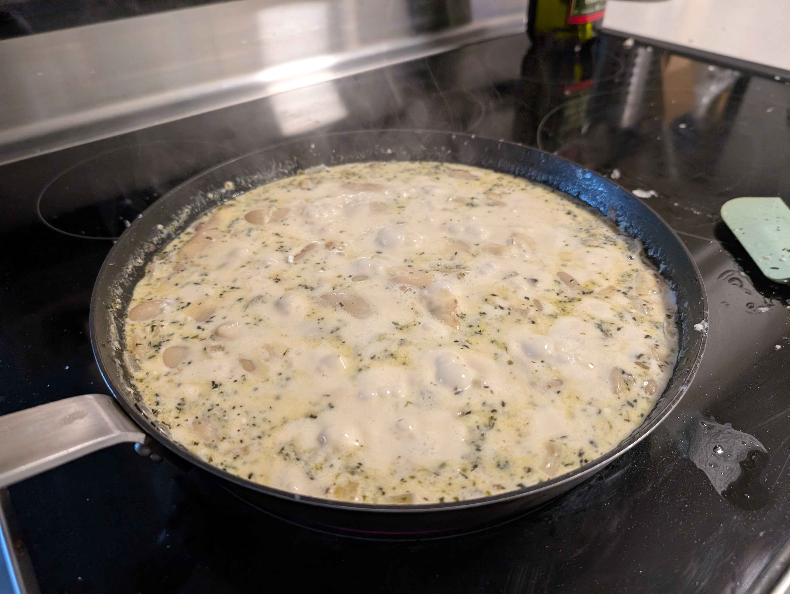
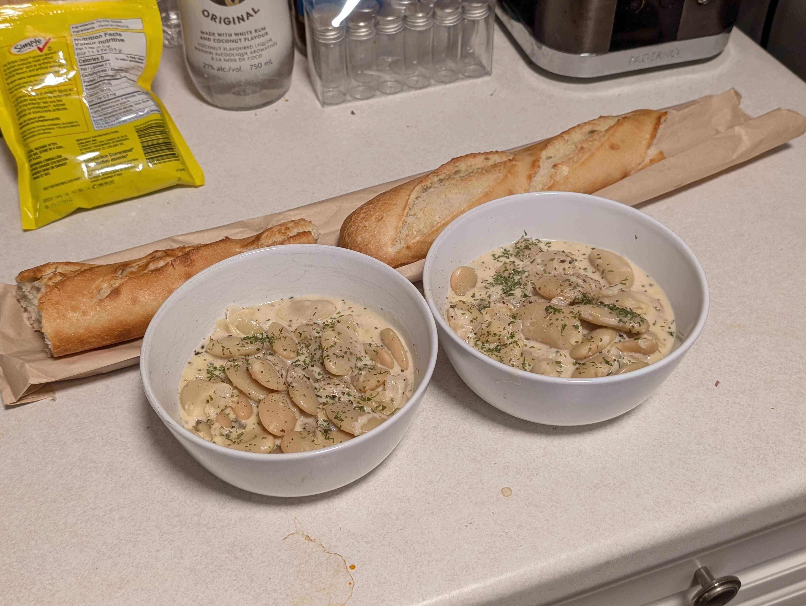

Keeping up with my [2026 Bingo Card](/blog/2025_bingo), I'm making one new recipe each month.
This morning, one of my buddies, Coryn, sent me a recipe that she thought I may enjoy.
It makes me happy that people are realizing that I'm getting into cooking new recipes more often and sending me recipes without me asking.
This time, I was sent a <a href="https://www.eatingwell.com/creamy-garlic-parmesan-butter-beans-8761165" target="_blank" rel="noopener noreferrer">Creamy Garlic-Parmesan Butter Beans</a> recipe.
People send me recipes from time to time and I don't always make them, but I woke up craving something creamy, so this spoke to me.

I've had my year of tofu, and now it seems like I'm having my year of beans.
Almost everything I've made recently is something bean related.
Costco hasn't been stocking tofu recently, which I usually buy in bulk.
This has pushed me into beans, wheather I wanted to be here or not.
Luckily, it's been working out.
These bean dishes have been fun to make, and I've never had lima beans before, so I'm hopeful!

## Ingredients
- 2 cans of lima beans
- 1/2 a sweet onion, chopped
- 6 garlic cloves, chopped
- 2 oz softened cream cheese
- 1 cup of grated parmesan
- 1 1/4 cup of vegetable broth
- 1 tsp italian seasoning
- 1/2 tsp cracked black pepper
- olive oil
- a baguette

## Tools Needed
- Large skillet (or any frying pan)
- Wooden spatula

## Preparation
1. Drain and rinse beans.
2. Chop your garlic and onion.
3. Measure out your grated parmesan and vegetable broth.

## Cooking
1. Heat olive oil over medium heat. Cook onions until golden.
2. Combine pepper and seasoning until fragrant.
3. Add vegetable broth and wait for a simmer.
4. Stir in cream cheese, mixing until fully combined.
5. Throw in your parmesan, then your beans. Stir and reduce until desired thickness.

    
    

From here, you can garnish with whatever you'd like.
I had some dried parsley flakes, so I garnished with that and a little more black pepper.
Keep in mind, it'll thicken more on its own as it cools down, so try not to reduce it too much.
I guess if you like it *really* thick, go hard.
You know how you like your food.

## Final Result

**My partner's thoughts:**
I don't like lima beans, as I've just now found out.
The recipe itself isn't bad, but it's very clearly a health recipe.
I would expect there to be some kind of butter instead of just cream cheese.
The seasoning was too strong.
It's a lot simpler to make than I expected, not as much time.

**My thoughts:**
It was tasting really good with the baguette until I ran out of it.
It's very salty and has a strong taste that's hard to stomach without having a litre of water next to you.
I'm not really sure why it turned out that way, I followed the recipe exactly.
My only assumption is that I didn't get "no salt vegetable broth" because that's just not a thing in reality unless you're going to Trader Joe's, which isn't in my country.

It's a cheap and filling dinner.
It was 10 CAD, 5 CAD per person.
We had enough left over for another bowl and a half.
Unfortunately, I really have no strong feelings about this dish what-so-ever.
It's just fine.
If I had to rate it, somewhere around a 5/10.
Because my partner didn't like it, I don't foresee I'll ever be making this again.
I'm glad I made it, though, I was craving something creamy!